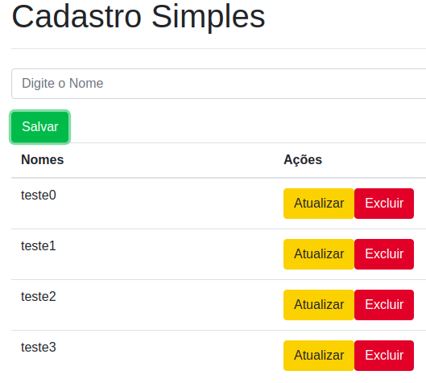

<h1>Docker_Crud</h1>

O objetivo deste repositório é apresentar um exemplo simples de cadastro em que 
    os ambientes de produção foram construídos a partir de containers e imagem do Docker. Trata-se d eum repositório
    utilizado para o estudo do autor e assim podem haver alguns erros na implementação.
    A maior parte dos códigos foram retirados do curso da COD3R sobre Docker e assim os créditos devem ser dadas ao mesmo.
    Em especial, agradecimentos as aulas do professore Leonardo Moura Leitão.

<h3>Resultado Final</h3>

Como resultado das aulas foi possível construir um cadastramento simples mas funcional e modularizado pelos containers de frontend, backend e banco de dados em mongodb.

<h3>Minhas anotações...</h3>

Anotações sobre os comandos básicos do Docker, em especial ao instalar e usos iniciais:

<b>1) Verificação de Instalação:</b>

<code>docker container run hello-world</code>

<b>2) Em caso de erro rodar:</b>

sudo groupadd docker

sudo usermod -aG docker ${USER}

newgrp docker

docker run hello-world

<b>3) Testando novamente:</b>

docker container run hello-world

<b>4) Verificando as versões:</b>

bash --version

docker container run debian bash --version

<b>5) Agora verificando container ativo:</b>

docker container ps

<b>6) Remover um container:</b>

docker container run --rm debian bash --version

<b>7) Para entrar no container (no terminal):</b>

docker container run -it debian bash

<b>8) Criação de arquivos dentro do container:</b>

touch curso-docker.txt

ls curso-docker.txt

<b>9) O run sempre cria um novo container então veja que:</b>

docker container run --name mydeb -it debian bash

<b>10) Para startar um container fazer o seguinte:</b>

docker container start -ai mydeb

<b>11) Para mapear as portas de um container:</b>

docker container run -p 8080:80 nginx

<b>12) Para rodar um servidor setando um diretório numa pasta do computador host basta fazer o seguinte:</b>

docker container run -p 8080:80 -v $(pwd)/html:/usr/share/nginx/html nginx

Depois é só acessar o servidor local com localhost:8080 que vai estar lá o index.html.
    
<b>Observação:</b> É necessário colocar o diretório na pasta onde está situado o html, caso contrário não será possível visualizar a página que está sendo mandada para o servidor.
Para maiores informações basta olhar o html pelo localhost que possui outras dicas. Está localizado em ex-volume/html.
    

